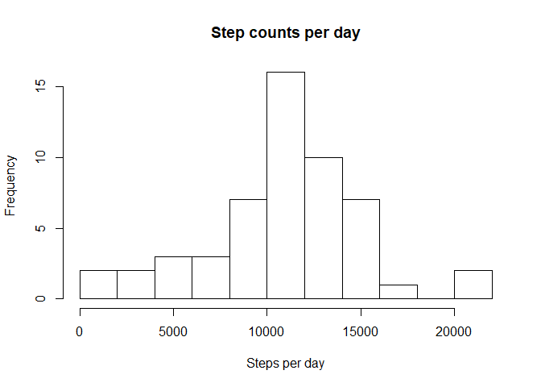
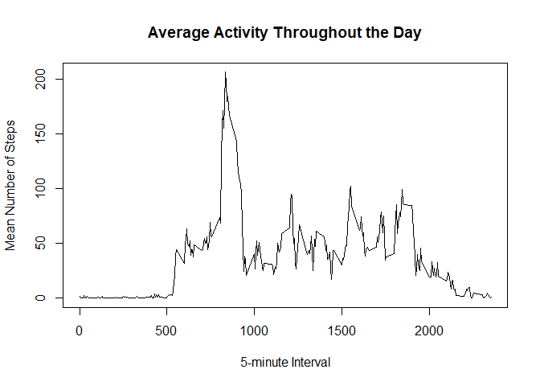
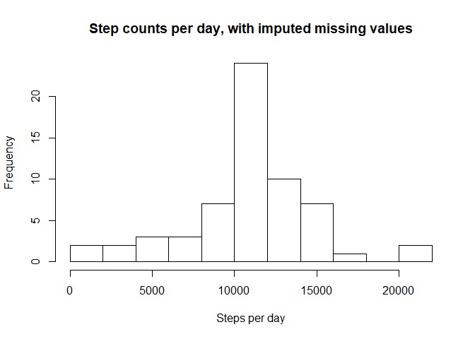

## Loading and preprocessing the data

The personal activity data, provided by an anonymous individual is loaded with the following code.


```r
library(readr)
activity <- read_csv("activity.zip")
```

## What is mean total number of steps taken per day?

To simplify this inital analysis, the missing values are ignored. The steps measured are grouped by date, summed and then plotted as a histogram.


```r
library(dplyr)
```

```
## Warning: package 'dplyr' was built under R version 3.5.3
```

```r
dailysteps <- activity %>% 
    group_by(date) %>%
    summarise(total.steps = sum(steps))
hist(dailysteps$total.steps, breaks = 10, main = "Step counts per day", xlab = "Steps per day")
```

<!-- -->

The mean and median number of steps taken per day are reported by the summary function, along with a few additional summary statistics.


```r
summary(dailysteps$total.steps)
```

```
##    Min. 1st Qu.  Median    Mean 3rd Qu.    Max.    NA's 
##      41    8841   10765   10766   13294   21194       8
```

## What is the average daily activity pattern?

To report the average daily activity pattern, the data is first grouped by daily 5-minute interval and the mean for each 5-minute interval is then taken. This data is visualized as a time series in the following plot.


```r
act_pat <- activity %>%
    group_by(interval) %>%
    summarise(mean.steps = mean(steps, na.rm = TRUE))
with(act_pat, plot(interval, mean.steps, type = "l",
                   main = "Average Activity Throughout the Day",
                   xlab = "5-minute Interval",
                   ylab = "Mean Number of Steps"))
```

<!-- -->

```r
max.int <- act_pat$interval[which.max(act_pat$mean.steps)]
```

Interval number **835** is on average the most acitve 5-minute interval of the day.

## Imputing missing values


```r
na.count <- sum(is.na(activity$steps))
```

There are **2304** missing values in the original activity dataset.  
Because the missing values likely introduce bias into the dataset, we will use the average mean for each 5-minute interval as a method of imputing missing values.


```r
# The mean values for each 5-minute interval (computed in the section above) is added as a new column to the activity data.
corrected_act <- activity %>%
    left_join(act_pat, by = "interval")
# The location of missing values in the data are then determined and replaced by the corresponding 5-minute interval mean.
na_index <- which(is.na(corrected_act$steps))
corrected_act$steps[na_index] <- corrected_act$mean.steps[na_index]
```

To see how imputing missing values affects the activity dataset, an updated histogram is plotted below. The data is grouped by date, and then the sum for each day is computed and plotted.


```r
dailysteps2 <- corrected_act %>% 
    group_by(date) %>%
    summarise(total.steps = sum(steps))
hist(dailysteps2$total.steps, breaks = 10, main = "Step counts per day, with imputed missing values", xlab = "Steps per day")
```

<!-- -->

Imputing the missing values as the mean for each 5-minute interval resulted in an overall increase in the total number of steps per day. This had the largest impact on the relative frequency of mid-activity days (between 10000 - 14000 steps per day).

Again, the mean and median number of steps taken per day are reported by the summary function, along with a few additional summary statistics. As can be seen compared to the previously reported statistics, the median value becomes equivalent to the mean value in the updated dataset.


```r
summary(dailysteps2$total.steps)
```

```
##    Min. 1st Qu.  Median    Mean 3rd Qu.    Max. 
##      41    9819   10766   10766   12811   21194
```

## Are there differences in activity patterns between weekdays and weekends?

To answer this last question with the updated dataset (in which missing values are imputed), the dataset is first annotated with the variable "weekday" or "weekend". The data is then grouped by  5-minute interval as before and plotted.


```r
library(ggplot2)
correct_act_pat <- corrected_act %>%
    mutate(week.part = if_else(weekdays(date) %in% c("Saturday", "Sunday"), "weekend", "weekday")) %>%
    group_by(interval, week.part) %>%
    summarise(steps.total = sum(steps))

# To show a comparative time series for weekday vs weekend activity the data is seperated as a facet using the ggplot2 system.
myplot <- ggplot(correct_act_pat, aes(interval, steps.total))
myplot + geom_line() + facet_grid(rows = vars(week.part)) + labs(x = "Daily 5-minute Interval", y = "Mean Number of Steps", title = "Average Activity Throughout the Day", subtitle = "Weekdays vs Weekends")
```

<!-- -->

As can be seen in the comparative time series, the anonymous individual is less active on average on the weekends vs the weekdays. The individuals activity pattern is more homogenous throughout the day as well.
